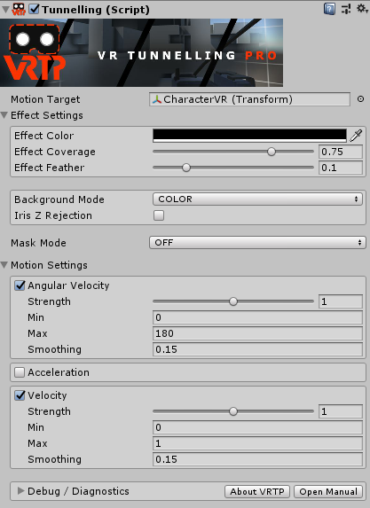

# Most updated version on https://gitlab.com/dacaes/SimpleVR
# SimpleVR

Unity3D VR lightweight framework.

Created by **Daniel Castaño Estrella** at **Lince Works**.

Contact: daniel@linceworks.com

License in LICENSE file.

**IMPORTANT:** Only SteamVR plugin dependency is included. Others should be downloaded and placed in Assets/Plugins folder.

Read the instructions to make sure everything works ok.

## Index

[SimpleVR capabilities](#SimpleVR-capabilities)

[Instructions](#Instructions)

[SimpleVR dependencies](#SimpleVR-dependencies)

[SimpleVR.Example dependencies](#SimpleVR.Example-dependencies)

[Recommended plugins](#Recommended-plugins)

## SimpleVR capabilities

SimpleVR is a lightweight framework for Unity3D that solves common issues and features every VR game needs.

Main features:
* Locomotion and Teleportation
* Object Manipulation
* Management of walls and obstructions
* Support SteamVR Input system
* ...

It uses SteamVR plugin only to support its input system. You can map interactions with VR controllers with its editor.

### Sample images and gifs

*Note: When you read about walls, it means something that has a collider but not physics simulation (not RigidBody).*

- Locomotion (with joystick and head movement working together)
  - Example of head movement:
    - 
- Easy teleport setup
  - CharacterVR class public methods:
    - MoveTo
    - SetPosition
    - LookAt
    - SetRotation
    - SetRotation
    - SetYawRotation
    - AddYawRotation
    - Rotate
- Capsule and sphere **Interactable** detection
  - Interactable and Grabbables (inherits from Interactable) can be:
    - Ethereal: detectable through walls
    - Constrained Detection: Can't detect with capsule, only sphere
    - Undetectable: Can't be detected (can't interact with)
- Attachment points for Grabbable gameObjects (don't depend on the pivot of the object to grab it)
  - 
- Fade to black next to walls (depends on the direction player is looking at)
  - 
- Can't grab objects through walls, even can't push objects through walls with hands or other objects, can't release object until it is outside a wall.
  - 
  - can't grab the object until player moves to the other side of the wall
  - 
- Slots to store your objects
  - 
  - Different slot types (Slot and Grabbable must match their Attachment Type Name to interact) and a slot can't have an Initial Grabbable (instantiates a Grabbable object on Start)
    - 
    - 
- Linear Drive with positions and animations (**Auto Return** option: 1st drawer and animated cube)
  - 
- Easy config with ScriptableObjects
  - 
  - 
  - 
  - 

## Instructions

Download and open SimpleVR project with Unity 2018.3+

Download **SimpleVR Dependencies** (links below) and place them on Assets/Plugins folder (except SteamVR, it goes inside Assets folder directly).

Download **SimpleVR.Example dependencies** and **Recommended plugins** too, place them inside Assets/Plugins.

**IMPORTANT:** Probably you'll notice some errors at this point, continue with the tutorial and they will be fixed.

Since 2018.3, **UnityEngine.SpatialTracking** namespace (which is needed by SimpleVR) has been moved to a package.

To install it (or update it) go to *Window > Package Manager* and in *Packages* window, select *All packages > XR Legacy Input Helpers* and **install** or **update**.

Create an **Assembly Definition** for QuickOutline plugin and SuperScience plugin:

- Right click on the QuickOutline folder and SuperScience folder in the Project window, *Create > Assembly Definition*.

Add the **Assembly Definition Reference** of *UnityEngine.SpatialTracking* (no the UnityEditor.SpatialTracking) to the **SuperScience** assembly definition and **Apply**.

Add assembly definitions to **SimpleVR** assembly, the same way, until it looks like:

Be sure that LeftHand and RightHand gameObjects in CharacterVR.prefab have PoseProvider component and copy the Tunnelling component data as seen in the image to the camera gameObject.

After that, everything should be ok. If not, restart Unity Editor.

## SimpleVR dependencies

- SteamVR (included in the project) [https://github.com/ValveSoftware/steamvr_unity_plugin](https://github.com/ValveSoftware/steamvr_unity_plugin)
- SuperScience https://github.com/Unity-Technologies/SuperScience
  - GizmoModule
  - PhysicsTracker
- DOTween: Translate Grabbable on attach. https://assetstore.unity.com/packages/tools/animation/dotween-hotween-v2-27676

## SimpleVR.Example dependencies

InteractableFeedback.cs needs:

- Quick Outline [https://assetstore.unity.com/packages/tools/particles-effects/quick-outline-115488](https://assetstore.unity.com/packages/tools/particles-effects/quick-outline-115488)

## Recommended plugins

- VR Tunnelling Pro [https://github.com/sigtrapgames/VrTunnellingPro-Unity](https://github.com/sigtrapgames/VrTunnellingPro-Unity)
  - If missing, there will be a missing script in **CharacterVR** prefab's camera.
